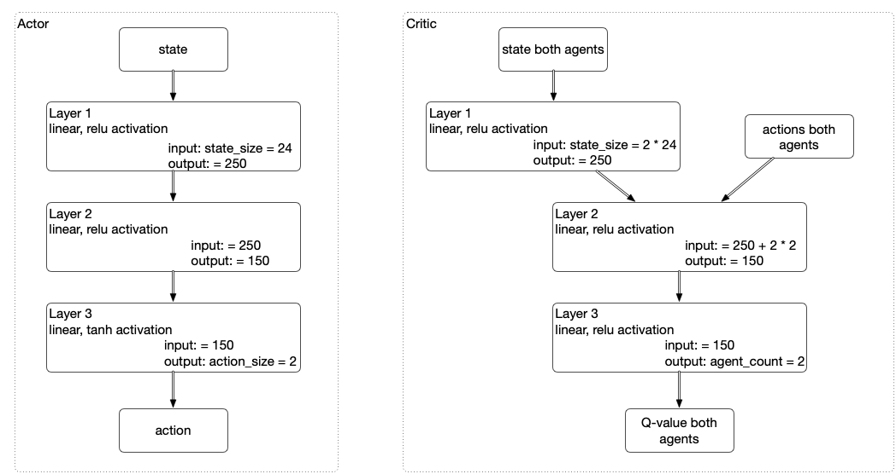
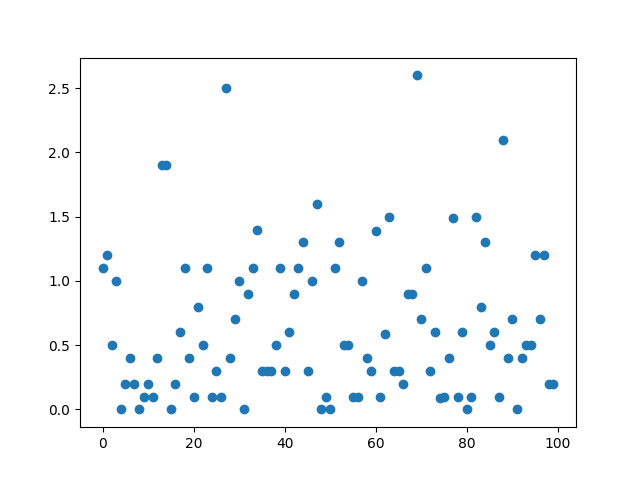

# Report Project: Collaboration and Competition

## Learning Algorithm

We use the algorithm MADDPG as described in
[Multi-Agent Actor-Critic for Mixed Cooperative-Competitive Environments, Lowe at al](https://papers.nips.cc/paper/7217-multi-agent-actor-critic-for-mixed-cooperative-competitive-environments.pdf)

In particular we took the DDPG implementation that we used for the previous project and added the multi-agent
ability on top of it.  This required changing the experience replay buffer to deal with joint observations, but
the key changes where in the learn step where we needed to deal with a critic network that has two output nodes.
One to predict the Q value for each of the agents.  The code there has not been made generic to number of agents
but is still specific to the two agent case:

    actor_1_loss = -self.critic_local(states, torch.cat([actions_1_pred, actions[:, 2:]], 1))[:, 0].mean()
    
the loss of actor 1 is the negative of the value of the critic in this state, evaluated using the predicted actions
of actor 1 combined with the actual actions of agent 2.  Then we take the mean of the first output of the critic (the
second output is for the other actor).

Learning parameters (these are configured in the `config.yaml` file)

| parameter            |  value   |
|----------------------|----------|
| buffer_size          |  100000  |
| batch_size           |  128     |
| gamma                |  0.99    |
| tau                  |  1e-2    |
| learning_rate_actor  |  1e-4    |
| learning_rate_critic |  1e-4    |
| weight_decay         |  0       |
| update_every         |  1       |
| data_dir             |  "data/" |
|                      |          |
| actor_fc1_units      |  250     |
| actor_fc2_units      |  150     |
| critic_fc1_units     |  250     |
| critic_fc2_units     |  150     |
|                      |          |
| noise_mu             |  0.0     |
| noise_theta          |  0.15    |
| noise_sigma          |  0.2     |

These parameters with the code in `model.py` lead to the networks as follows

## Learning

For the successful training run it took 3193 episodes to get the moving average over the last
100 episodes above 0.5, which was about an hour running time on my 2016 macbook pro.

On an evaluation run (without noise) of the trained models we noticed the two agents did not
learn equally well.  Of a 100 runs the left agent scores 22, the other 78.  The average
episode score during this evaluation run was 0.65, so the gain from dropping the noise on
these models was about 0.15.  The following graph shows the episode scores during the
evaluation

## Future Plans

This training and took a while (around an hour for the successful run, and longer for several
not successful runs) so trying the distributed algorithms would definitely be worth it.  Also
we are very curious about the effects of the noise.  In this traiing we kept the noise fixed,
but it is likely that once the agents were relatively trained the noise made them miss the
ball at times.  So maybe training can be sped up with noise reduced over time.
