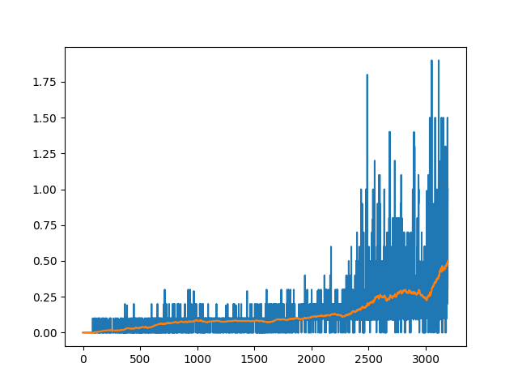

# Report Project: Collaboration and Competition

## Learning Algorithm

Learning parameters (these are configured in the `config.yaml` file)

| parameter            |  value   |
+----------------------+----------+
| buffer_size          |  100000  |
| batch_size           |  128     |
| gamma                |  0.99    |
| tau                  |  1e-2    |
| learning_rate_actor  |  1e-4    |
| learning_rate_critic |  1e-4    |
| weight_decay         |  0       |
| update_every         |  1       |
| data_dir             |  "data/" |
|                      |          |
| actor_fc1_units      |  250     |
| actor_fc2_units      |  150     |
| critic_fc1_units     |  250     |
| critic_fc2_units     |  150     |
|                      |          |
| noise_mu             |  0.0     |
| noise_theta          |  0.15    |
| noise_sigma          |  0.2     |

## Learning

## Future Plans

This training and took a while (around an hour for the successful run, and longer for several
not successful runs) so trying the distributed algorithms would definitely been worth it.
